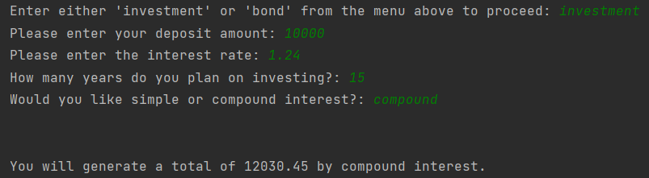

# Financial Management tool (Capstone Project)

This Capstone Project was done early on during my Data Science bootcamp and draws upon what we had learnt within the first couple of weeks. This programme allows the user to calculate their interest on an investment or calculate the amount that should be repaid on a home loan each month.

## Installation
Please see the below instructions:

1. Go to the link https://github.com/poonampavlou/Capstone-Project-no.-1
2. On the right hand side, click on the green button called "Code"
3. Download ZIP
4. Run finance_calculators.py
    
## Usage/Examples

The initial landing page will ask the user whether they want to calculate the amount of interest they would earn
on their investment or how much they would expect to pay back on a home loan. Please see below a played out example:

